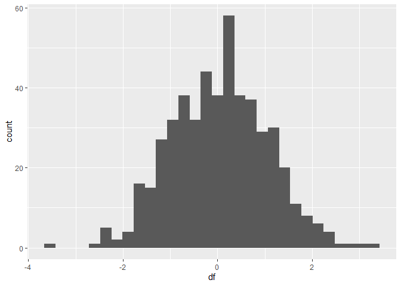

Rmarkdown Test
================
Beth Sosik
2024-05-28

write a single sentence

``` r
library(ggplot2)
df<-rnorm(500)
df<-as.data.frame(df)
ggplot(df, aes(x=df))+geom_histogram()
```

    ## `stat_bin()` using `bins = 30`. Pick better value with `binwidth`.

<!-- -->
